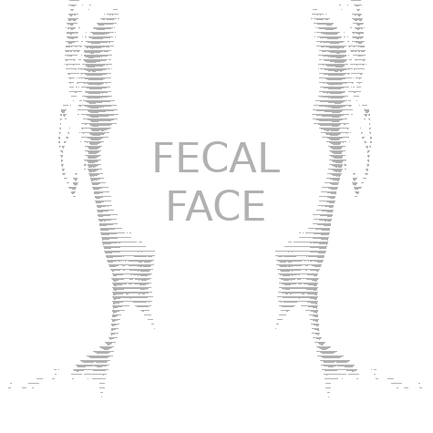

<div align="center" style="margin-bottom: 10px;">
    <a href="https://twitter.com/intent/follow?screen_name=kennbroorg">
	
    </a>
</div>

<div align="center" style="margin-bottom: 10px;">
    
    
    
    
</div>

<div align="center">
    <a href="https://gitlab.com/kennbroorg/shit-bucket/fecalface/-/blob/master/README.es.md">
	
    </a>
</div>

---

<div align="center">   

[Description](#description)&nbsp;&nbsp;&nbsp;|&nbsp;&nbsp;&nbsp;[Installation](#installation)&nbsp;&nbsp;&nbsp;|&nbsp;&nbsp;&nbsp;[Website][website]&nbsp;&nbsp;&nbsp;|&nbsp;&nbsp;&nbsp;[Issues][issues]

</div>

---

<!--
Website References
-->
[website]:https://kennbroorg.gitlab.io/shit-bucket/fecalface-page
[issues]:https://gitlab.com/kennbroorg/shit-bucket/fecalface/-/issues

<h1 align="center">FecalFace</h1>

<div align="center">
     
</div>

---

<h2 id="description">Description</h2>
Fecal face was born from the concept of "Shit Bucket" where the idea is to try to rot the data they have about each other.  
Specifically, it is related to the detection and recognition of faces. 
The motivation of this project is that the companies that collect our faces can no longer identify us.

This project (PoC for now) involves :

- Detect faces in the avatars of the entered RRSS 
- Identify them with your own account
- Use adversarial inputs attack to protect it
- Check detection without identification
- Make available for download to use the protected avatar

**This project is part of Shit Bucket tools**

###  What it does
It collects the avatar from a RRSS, tries to determine the position of a face if it exists and then attacks it in order to make the final comparison between the original face and the attacked one not recognizable by an AI, but for human eye will look similar.

###  What it doesn't
This project will not cause our faces to be confused with panda bear's one. And at this moment the project  doesn't work with avatars with more than one face.

###  Attack process
The attack process is very processing intensive, taking between 5 and 7 minutes. Be patient or buy GPUs. 
> The above clarification is important and is also in the disclaimer

## Website
Visit the [website][website] of the project.

<h2 id="installation">Installation</h2>

## Easy Installation (Only Python)

Go to our [website][website]. Download the ZIP file and unzip it.
```
unzip latest.zip
cd Fecalface-pack
pip install -r requirements.txt
cd backend
python app.py -e prod
```
And, finally, [browse](#browse) it.

## Complete Installation (for DEV)

### Clone repository

```shell
git clone https://gitlab.com/kennbroorg/iKy.git
```

### Install Backend

#### Python stuff

You must install the libraries inside requirements.txt

```shell
python3 -m pip install -r requirements.txt
```

### Install Frontend

#### Node

First of all, install [nodejs](https://nodejs.org/en/).

#### Dependencias

Inside the directory **frontend** install the dependencies

```shell
cd frontend
npm install
```

## Wake up FecalFace

### Turn on Backend

#### Python stuff

Turn on backend in a terminal, within the directory **backend**

```shell
python3 app.py
```

### Turn on Frontend

Finally, to run frontend server, execute the following command from directory **frontend**

```shell
npm start
```

<h3 id="browser">Browser</h3>

Open the browser in this [url](http://127.0.0.1:9001) 

<h2 id="issues">Issues</h2>

If you experience any problems or have any suggestions, you are welcome to create an issue.

<div align="center">   

[](https://gitlab.com/kennbroorg/shit-bucket/fecalface/-/issues)

</div>

## Disclaimer

Anyone who contributes or contributed to the project, including me, is not responsible for the use of the tool (Neither the legal use nor the illegal use, nor the "other" use).

Keep in mind that this software was initially written for educational purposes (to educate ourselves), and now the goal is to collaborate with the community making quality free software, and while the quality is not excellent (sometimes not even good) we strive to pursue excellence.

The attack process is very processing intensive, taking between 5 and 7 minutes. Be patient or buy GPUs.

We do not refund your money if you are not satisfied.
I hope you enjoy using the tool as much as we enjoy doing it. The effort was and is enormous (Time, knowledge, coding, tests, reviews, etc.) but we would do it again.
Do not use the tool if you cannot read the instructions and / or this disclaimer clearly.

By the way, for those who insist on remembering my mother, she died many years ago but I love her as if she were right here.
